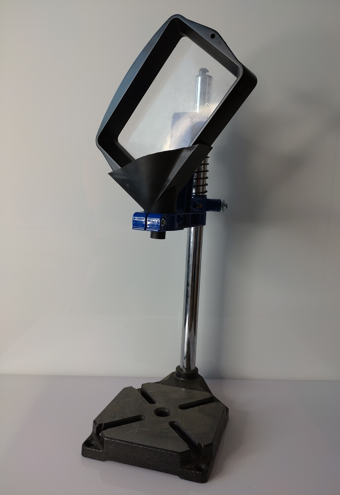

# Elegoo-Mars3
Some usefull parts for Elegoo Mars 3 MSLA printer.

Some SVG and STL files i created in Inkscape and Rhino 7 for my Elegoo Mars 3 printer.

## Elegoo Mars 3 Screen Protector Gasket
I had an damaged Resin tank which leads to a dirty LCD-Screen protector film. 
When i tried to remove the hardend resin, i broke the protector film and had also 
renew the black gasket around the LCD. Hard to find this part. You can buy a new 
LCD Screen which is delivered with a new gasket. But the LCD itself was OK.

Since i bought an Cameo 4 plotter, i decided to cut my own gasket. I use a standard Vinyl foil.
You can also use a better quality foil used for automotiv stuff. 
The original one has a thickness of 0,11 mm (both, the gasket and the FEP film).

 

## Elegoo Mars 3 Additional Screen Protector under VAT (VAT size) and Seal
To make things easy, i made this additional Screen Protector under the VAT 
and a Seal to prevent Resin running under the the Protector foil. I cut both 
with the Silhouette Cameo 4 plotter. The Seal foil should as thin as possible.

 

## Elegoo Mars 3 Magnetic Build Plate Holder for IPA Tank.
My Mercury 2in1 washer/curer has only a metal box inside. Maybe there is a pro Version
which has also a Build-Plate holder. The downside of this holder is, you can't close the sealed 
tank. You have to wash your parts with the tank open.

I created my own Build-Plate holder. It has a magnet on top
I placed another magnet (both 20x3 mm Neodym-Magnets) on top of the tank cover.
Works great.

 

## Elegoo Mars 3 Build-Plate Drip-Holder
45° Drip holder for Elegoo Mars 3 Build-Plate.

 

## Elegoo Mars 3 VAT cleaner
On Thingyverse i found some VAT cleaners but not for the special Mars 3 VAT and my personally needs. 
I got a cheap mobile Drill-Stand with a 42 mm diameter hole. The VAT cleaner should fit to this Drill-Stand.
So i created my own one that fit's and prevent the VAT from falling off. There is a 20 mm channel where i can place a metal filter mesh.
I found cheap 20 mm stainless steel strainer used in (smoke) pipes. Works pretty well.
I printed it with cheap ABS-like Resin on the Mars 3. 

 
 
 

## IPA cleaner filter
I use the Elegoo Mercury Plus 2.0 washer/currer combo. The washer has 3,5 l volume. To clean the IPA and reuse it, i got another
sealed 5 l Box. I use a cheap manual fuel pump to put the IPA from the washer tank to the 5 l tank that i put outside in the sun for about 2 week.
I created this two filters for the pump to prevent pumping Resin residue from the washer tank and later from 5 l tank back into bottles.
I printed it with cheap ABS-like Resin on the Mars 3. 

 
 
 
 

